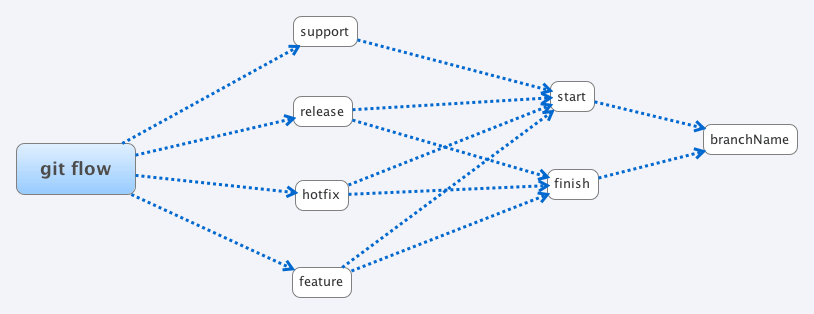

=================
Git Flow Commands
=================

:Author:    Jan Börner
:Date:      2012-09-07

Abstract
========

The following tutorial explains you the syntax and commands
of git flow.

Syntax & Commands 
=================

If you did the "using gitflow" tutorial, you maybe have seen, that
the commands are very similar to each other.You just need a few key words.
This map shows how you can combine the different commands.
Of course you can use the normal git commands like checkout,pull,push,etc.

The support command is a special one, you can't finish this branch and the 

syntax to open it is ::

	git flow support start [supportName] [tagName] 

